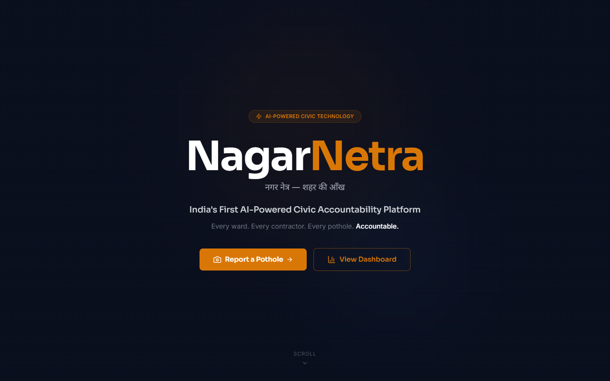
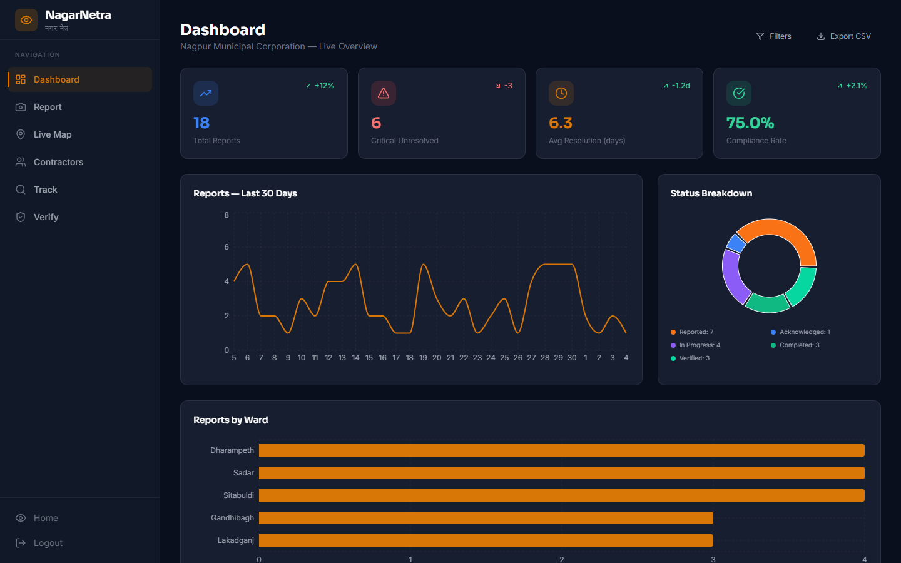
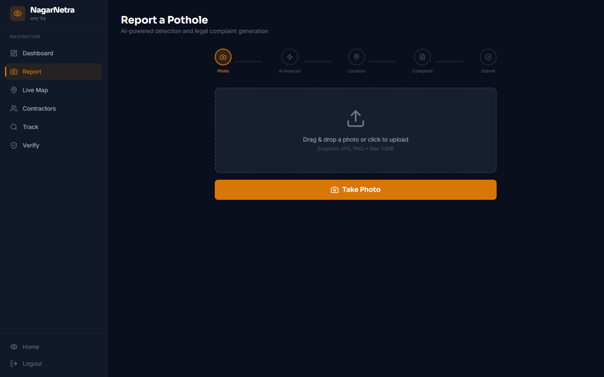
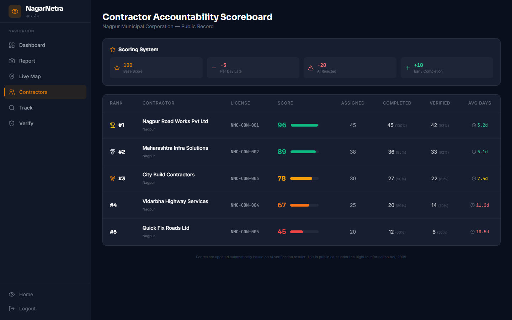
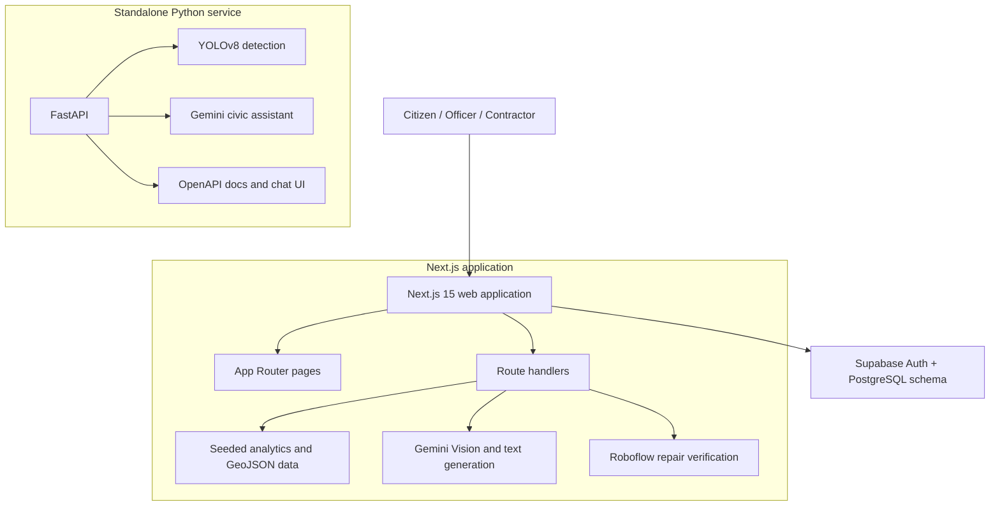

<div align="center">

# NagarNetra

### नगर नेत्र — शहर की आँख

**AI-powered civic road accountability for citizens, municipal teams, and contractors**

NagarNetra turns a road-damage photo into structured evidence, a severity assessment, a formal complaint, a public map record, and a repair-verification workflow.

[](https://nextjs.org/)
[](https://react.dev/)
[](https://www.typescriptlang.org/)
[](https://fastapi.tiangolo.com/)
[](https://supabase.com/)
[](https://leafletjs.com/)

[Overview](#what-it-does) · [Workflow](#how-it-works) · [Features](#features) · [Architecture](#architecture) · [Setup](#run-locally)

</div>



---

## What it does

NagarNetra is a civic-technology prototype focused on pothole reporting and public accountability in Nagpur, India. A citizen can upload a road photo, attach location evidence, receive an AI-assisted damage assessment, and generate an RTI-style complaint. Municipal views then surface ward-level trends, unresolved critical damage, repair status, and contractor performance.

The project contains two complementary applications:

- A **Next.js web platform** for citizen reporting, maps, analytics, authentication, complaint tracking, contractor scoring, and repair verification.
- A **FastAPI AI service** with YOLOv8 detection, Gemini-powered civic assistance, image verification, RTI drafting, and repair-cost estimation.

> [!IMPORTANT]
> This repository is a working prototype, not an official government service. The dashboard, map, contractor scoreboard, and several API responses currently use seeded or fallback demo data. See [Current implementation status](#current-implementation-status).

## How it works

```mermaid
flowchart LR
    A[Citizen captures a road photo] --> B[Browser creates a SHA-256 evidence hash]
    B --> C[AI analyzes damage and severity]
    C --> D[GPS, ward, cost, and safety details are added]
    D --> E[RTI-style complaint is generated]
    E --> F[Report appears in tracking, map, and dashboard views]
    F --> G[Contractor submits an after-repair photo]
    G --> H[AI verification updates the public accountability record]
```



The lifecycle used throughout the interface is:

`Reported → Acknowledged → In progress → Completed → Verified`

## Features

### Citizen reporting

- Drag-and-drop or camera-based photo submission.
- Browser-side SHA-256 hashing for an evidence fingerprint.
- Browser geolocation and reverse-geocoded address capture.
- Gemini Vision analysis for damage type, confidence, estimated dimensions, safety risk, recommended repair, cost range, and L1–L3 severity.
- AI-assisted RTI-style complaint generation.
- Complaint-number tracking and status timelines.

### Public accountability

- Ward-level dashboard with totals, critical unresolved cases, average resolution time, compliance rate, trends, and status distribution.
- Leaflet map with severity, status, and ward filters.
- Public contractor scoreboard covering assigned, completed, verified, average completion time, and accountability score.
- Repair-verification flow for before/after evidence.

### Platform and data

- Responsive Next.js App Router interface with Tailwind CSS and Framer Motion.
- Supabase authentication flows for citizens, officers, contractors, and administrators.
- Supabase schema, seed data, and Row Level Security policies.
- GeoJSON-compatible pothole API.
- Separate FastAPI service with interactive OpenAPI docs.

## Product tour

<table>
  <tr>
    <td width="50%"><strong>Operations dashboard</strong></td>
    <td width="50%"><strong>Citizen reporting flow</strong></td>
  </tr>
  <tr>
    <td></td>
    <td></td>
  </tr>
</table>

### Contractor accountability



## Severity model

| Level | Meaning | Web analysis guideline | Typical action |
| --- | --- | --- | --- |
| **L1** | Minor | Shallow damage below roughly 5 cm | Routine monitoring and patching |
| **L2** | Moderate | Damage around 5–15 cm deep | Prioritized repair |
| **L3** | Critical | Deep or structurally dangerous damage above roughly 15 cm | Immediate escalation |

The standalone YOLOv8 service uses a different heuristic: the detected bounding-box area as a percentage of the image (`<5%`, `5–15%`, and `>15%`). These rules are prototype classifications and should be calibrated with field data before operational use.

## Architecture



The Next.js UI currently calls its own route handlers. `main.py` is an independent AI microservice included in the same repository; it is not yet the data source for the Next.js dashboard.

## Technology stack

| Layer | Technology | Purpose |
| --- | --- | --- |
| Web | Next.js 15, React 19, TypeScript | Pages, server routes, rendering, and application logic |
| UI | Tailwind CSS, Framer Motion, Lucide | Styling, animation, and iconography |
| Analytics | Recharts | Trend, status, ward, and severity visualizations |
| Maps | Leaflet, React Leaflet | Geospatial display and filters |
| Auth / data | Supabase | Authentication, PostgreSQL schema, seed data, and RLS |
| Web AI | Gemini API | Image analysis and complaint generation |
| Verification | Roboflow API | Optional after-repair image verification |
| Python AI | FastAPI, Ultralytics YOLOv8, OpenCV, PyTorch | Standalone detection and civic-assistant service |

## Application routes

| Route | Purpose |
| --- | --- |
| `/` | Project landing page and workflow overview |
| `/report` | Photo analysis, evidence capture, complaint generation, and submission |
| `/dashboard` | Municipal analytics and recent reports |
| `/map` | Filterable pothole map |
| `/contractors` | Public contractor accountability scoreboard |
| `/track` | Complaint lookup and status timeline |
| `/verify` | Contractor repair-photo verification |
| `/login`, `/signup` | Supabase authentication and role-based registration |

## Run locally

### Prerequisites

- Node.js 20 or newer and npm
- Python 3.10+ for the optional FastAPI service
- A Supabase project for authentication and persisted data
- A Gemini API key for live photo analysis and complaint generation
- A Roboflow API key only if live repair verification is required

### 1. Clone and install the web application

```bash
git clone https://github.com/mohithadap-dotcom/Nagar-Netra-New.git
cd Nagar-Netra-New
npm install
```

### 2. Configure environment variables

```bash
cp .env.example .env.local
```

On Windows PowerShell, use:

```powershell
Copy-Item .env.example .env.local
```

Fill in the values required for the integrations you want to use:

| Variable | Required for | Notes |
| --- | --- | --- |
| `NEXT_PUBLIC_SUPABASE_URL` | Authentication and Supabase clients | Project URL from Supabase settings |
| `NEXT_PUBLIC_SUPABASE_ANON_KEY` | Authentication and Supabase clients | Use the public anon key, never a service-role key |
| `GEMINI_API_KEY` | Live detection and complaint generation | Used server-side by Next.js and FastAPI |
| `ROBOFLOW_API_KEY` | Live repair verification | Optional; the route otherwise returns a mock result |

Never commit `.env.local` or real API credentials.

### 3. Prepare Supabase

Open the Supabase SQL editor and run [`supabase/migration.sql`](supabase/migration.sql). It creates:

- `users`
- `contractors`
- `complaints`
- `potholes`
- `verifications`
- seed records and initial Row Level Security policies

Review the supplied policies before production use; they prioritize prototype transparency and are intentionally permissive for some public reads.

### 4. Start the web application

```bash
npm run dev
```

Open [http://localhost:3000](http://localhost:3000).

### 5. Start the optional FastAPI service

```bash
python -m venv .venv
```

Activate it:

```bash
# macOS / Linux
source .venv/bin/activate

# Windows PowerShell
.venv\Scripts\Activate.ps1
```

Install and run:

```bash
pip install -r requirements.txt
uvicorn main:app --reload --host 0.0.0.0 --port 8000
```

The first launch may download the YOLOv8 model weights. Visit [http://localhost:8000/docs](http://localhost:8000/docs) for interactive API documentation.

## Project structure

```text
Nagar-Netra-New/
├── src/
│   ├── app/                 # Pages and Next.js route handlers
│   ├── components/          # Navigation and map components
│   └── lib/                 # Types, constants, seed data, Supabase clients
├── supabase/
│   └── migration.sql        # Schema, seed records, and RLS policies
├── templates/               # FastAPI HTML interfaces
├── docs/images/             # README product screenshots
├── main.py                  # Standalone FastAPI + YOLOv8 service
├── requirements.txt         # Python dependencies
└── package.json             # Web scripts and dependencies
```

## Current implementation status

- Dashboard, map, tracker, and contractor views are populated primarily from in-repository seed data.
- `/api/stats` generates its recent-trend series on each request for demonstration purposes.
- Gemini and Roboflow routes contain mock fallbacks for unavailable or rate-limited integrations.
- The Supabase schema and auth screens are present, but the full report lifecycle is not yet persisted end to end.
- The Next.js and FastAPI detection paths use different severity heuristics and should be unified before production.
- Automated tests and a production deployment workflow are not yet included.

## Roadmap

- Persist reports, complaints, assignments, and verification results in Supabase.
- Replace seeded analytics with database-backed queries and realtime updates.
- Standardize the Next.js and Python detection contracts.
- Add role-based dashboards and stricter production RLS policies.
- Add automated unit, API, accessibility, and end-to-end tests.
- Add municipal notification delivery and auditable status-change events.
- Calibrate the severity model with representative Indian road datasets and field validation.

## Contributing

Contributions are welcome. Read [`CONTRIBUTING.md`](CONTRIBUTING.md) for the local workflow, quality checks, and pull-request expectations.

## Responsible use

- Do not treat AI severity or cost estimates as certified engineering assessments.
- Obtain consent and avoid including faces, vehicle numbers, or unrelated personal data in uploaded photos.
- Restrict CORS, review RLS policies, validate uploads, and add rate limiting before a public production launch.
- Rotate any credential that has ever been committed to Git history; removing it from the latest file does not invalidate the exposed key.

---

<div align="center">
Built for safer roads, transparent repairs, and measurable civic accountability.
</div>
